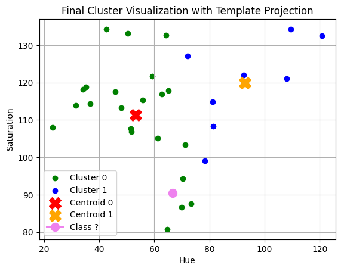
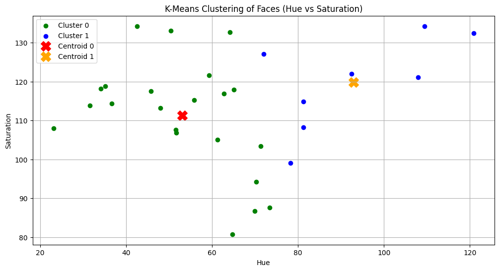
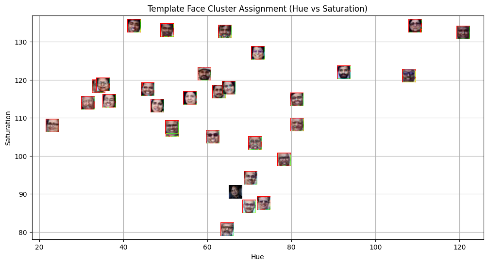
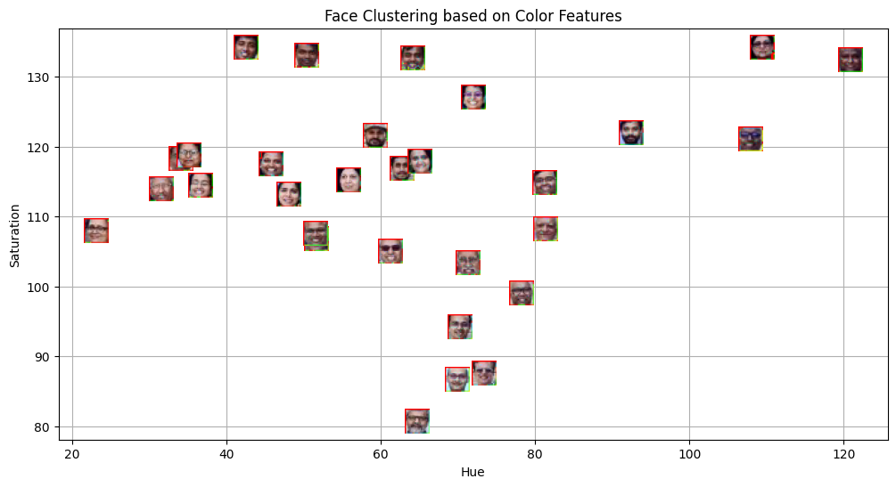

# Lab-5-MLPR-Face-Recognition-
# Face Clustering using K-Means (Hue–Saturation Features)

## Aim

This project explores whether simple color features (Hue and Saturation) can be used to group faces using an unsupervised learning approach.  
The goal was to observe how K-Means clustering behaves on visual data without identity labels.

---

## Methodology

1. Faces were detected from the input image using a Haar Cascade classifier.
2. For each detected face:
   - The image was converted to HSV color space.
   - Mean **Hue** and **Saturation** values were extracted.
3. The feature vectors (Hue, Saturation) were clustered using **K-Means (K = 2)**.
4. Cluster assignments and centroids were visualized.

Key idea → similar color characteristics may produce natural groupings.

---

## Visualisations

### Detected Faces

---

### K-Means Clustering (Hue vs Saturation)

---

### Template Projection & Classification

---

### Face Distribution by Features

---

## Key Findings

- Faces formed separable groups based on color features.
- Hue & Saturation alone can produce meaningful clusters.
- Centroids represent dominant color characteristics of each cluster.
- Some overlap exists → color is informative but not sufficient for identity tasks.

Important observation → clustering works, but semantics are limited.

---

## Conclusions

- K-Means effectively groups faces using low-dimensional color features.
- Feature choice strongly influences clustering behavior.
- Color-based clustering is useful for exploratory analysis, not recognition.
- Richer features (embeddings / deep features) would improve separation.

In essence → simple features reveal structure, but deeper representations reveal meaning.
